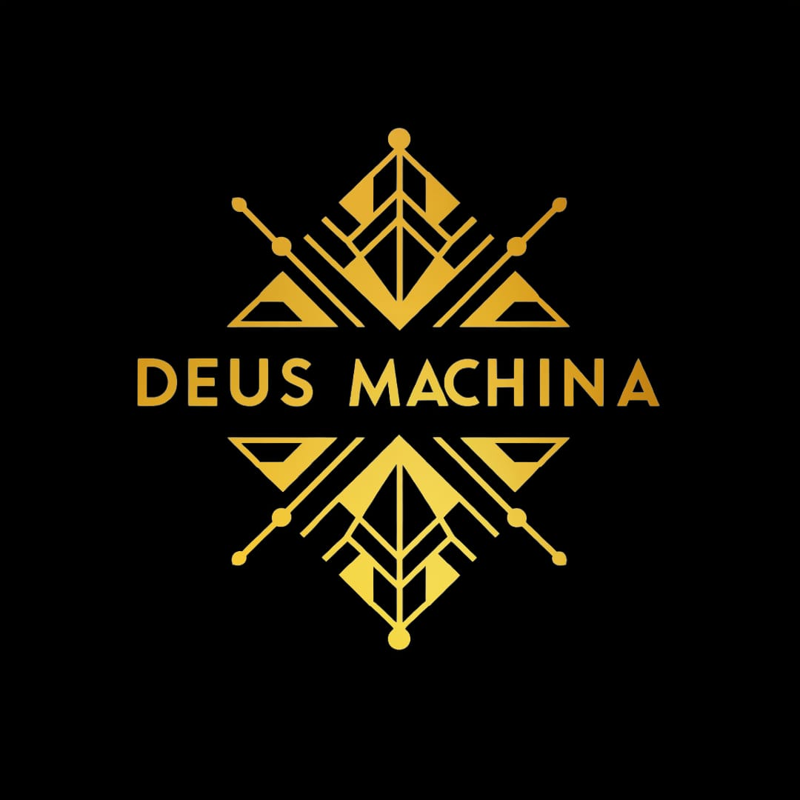

# Engineering Documentation - Team DeusMachina



## Introduction

In this repository you will find all the information related to the construction, design, and programming of the autonomous robot built by *Team DeusMachina* for the  Future Engineers category in the 2026 Season.
This has been an incredible journey with a lot of obstacles, and we have done our best to come up with a design that we were not only satisfied with, but one that could properly accomplish all of the objectives present in this edition of the competition.

## Contents

- [Team Members](#team-members)
- [Hardware Design](#hardware-design)
  * [Design Process](#design-process)
  * [Assembly Process](#assembly-process)
  * [Elements](#elements)
    + [3D Printed](#3d-printed)
    + [Electronics](#electronics)
- [Software Design](#software-design)
  * [Image and Sensor Processing](#image-and-sensor-processing)
    + [Image Capturing](#image-capturing)
    + [Processing Pipeline](#processing-pipeline)
    + [Distance / Position Detection](#distance--position-detection)
  * [Robot Movement](#robot-movement)
    + [Steering / Servo Configuration](#steering--servo-configuration)
    + [Robot Orientation](#robot-orientation)
    + [Route Determination](#route-determination)
  * [Data Sending](#data-sending)
- [Impact](#impact)
- [Our Journey](#our-journey)

---

# Team Members

[#team-members](#team-members)

- **[Kishan Kanta Barik]**:


> Hi, my name is Kishan Kanta Barik. I'm part of Team DeusMachina and I'm responsible for ROS2 Architecture & Embedded C . 

- **[Swastik Prasad Behera]**:


> Hello, I am Swastik Prasad Behera. I am the team's Designer and I'm responsible for Mechanical Designing and Assembly.

- **[Mohit Kumar Bera]**:


> I am Mohit Kumar Bera, the team's Electronics Engineering. I am in charge of Electronics circuits and wiring. 

- **[Achirangshu Patra ]**:


> Hi, my name is Achirangshu Patra . I have received the B.Tech. degree in Electrical Engineering from Budge Budge Institute of Technology, West Bengal, India, the Post Diploma in Industrial Automation and Robotics from MSME CTTC, Bhubaneswar, India, and the M.Tech. degree in Mechatronics Engineering from C.V. Raman Global University, Odisha, India. He also received the Post Graduate Certificate in Artificial Intelligence and Its Applications under the AICTE QIP program from the Indian Institute of Technology Kharagpur, India. He is currently pursuing the Ph.D. degree in federated unlearning for privacy-preserving machine learning in distributed edge systems at C.V. Raman Global University, where he is also an Assistant Professor and heads the Mitsubishi Electric Authorized Training Centre. He has conducted industrial training and technical workshops for professionals, faculty members, university and school students, covering industrial automation, PLC, HMI, drives, robotics, mechatronics, and Industry 4.0 technologies, with participants from organizations including JPL, JSP, Tata Motors, and other industrial institutions. He has served as a Jury Member for the India Skills National and Regional Competitions and as a WorldSkills Mentor for Industrial Control and Industry 4.0. He also mentors students in various technical competitions and hackathons, including the Mitsubishi Electric Cup, Janatics Automation Skill Challenge, and Smart India Hackathon, supporting students in project development, innovation, and competitive technical skills. His research interests include federated learning, machine unlearning, differential privacy, privacy-preserving edge intelligence, industrial automation, and intelligent cyber-physical systems. 

---

# Hardware Design

## Drivetrain Selection: All-Wheel Drive (4WD) — Single-Motor Dual-Differential System

### Design Overview

Unlike a conventional 4WD setup that uses one motor per axle or per wheel, our robot uses a **single central motor driving all four wheels through a two-differential, single-axle transmission system**. This keeps the drivetrain compact, reduces the number of motors (and therefore the current draw and control complexity), while still delivering torque to all four wheels.

### How the System Works

1. **Motor & Central Gearbox** — A single DC gear motor is mounted in-line with a central gearbox/transfer case (the black housing in the middle of the assembly). This gearbox receives the motor's output and reduces/redirects it into a longitudinal drive path.

2. **Central Driveshaft** — From the gearbox, a single output shaft (the long center driveshaft) runs the length of the chassis, connecting the front and rear ends of the drivetrain. This shaft is what allows one motor to power both axles simultaneously, similar in principle to a propeller shaft in a full-size AWD vehicle.

3. **Dual Differential Units** — At each end of the central driveshaft sits a **bevel-gear differential** (the two purple/magenta gear clusters — one front, one rear). Each differential takes the rotational input from the central shaft and splits it 90° outward to the left and right wheel axles on that end.

4. **Differential Function** — Because each end has its own differential, the left and right wheels on that axle can rotate at slightly different speeds during a turn (standard differential behavior), preventing wheel scrub while still keeping both wheels driven — something a solid/fixed axle can't do.

5. **Half-Shafts to Wheels** — From each differential, a short half-shaft (with a universal/CV-style joint visible in the model) transmits power outward to each wheel hub, ending in a hex adapter for the wheel.

### Why This Configuration

- **Single point of power input** — only one motor needs to be controlled, driven, and powered, which simplifies the motor driver wiring and current budgeting compared to a 4-motor independent-wheel setup.
- **True mechanical AWD** — because power is split at the differential (not electronically per motor), all four wheels stay mechanically synchronized, avoiding the wheel-speed mismatches that can occur with independently controlled motors that aren't perfectly tuned to each other.
- **Weight and space savings** — replacing 3–4 motors with one central motor and a geared/shaft transmission frees up space and mass elsewhere in the chassis for electronics, sensors, and battery placement.
- **Consistent traction front and rear** — since both axles are driven from the same source through matched differentials, torque delivery to the front and rear wheels stays proportional, improving stability under acceleration and through corners.

### Trade-offs

- **Mechanical complexity** — two differentials plus a central driveshaft and multiple universal joints introduce more moving/wearing parts than a single-motor RWD or independent-motor 4WD setup, and require tighter manufacturing/assembly tolerances (gear mesh, shaft alignment).
- **No independent wheel control** — because all wheels are mechanically linked through one motor, the robot cannot apply differential torque electronically (e.g., for skid-steer-style turning assistance); steering must still be handled entirely by the separate front Ackermann steering system.
- **Single point of failure** — if the motor, central gearbox, or driveshaft fails, the entire drivetrain is disabled, unlike a multi-motor 4WD where one motor failure might still leave partial mobility.
- **Assembly precision** — bevel gear differentials need careful backlash tuning; too much play causes drivetrain slop, too little causes binding and excess motor load.

### Comparison with Common WRO Drive Systems

Most WRO Future Engineers teams use one of a handful of drivetrain patterns. Here's how our AWD choice stacks up against the alternatives most commonly seen in the competition:

| Drive System | How it Works | Pros | Cons | Typical WRO Use |
|---|---|---|---|---|
| **Rear-Wheel Drive (RWD)** — *most common in WRO* | A single motor (often a "hex"/gear motor) drives the rear axle; front wheels are steered via a servo through an Ackermann linkage and are not powered. | Simple, lightweight, cheap, few failure points, easy to tune and repair mid-competition. | Less traction on low-grip surfaces or sharp accelerations; all propulsion load falls on two wheels. | The default choice for the large majority of Future Engineers robots, including earlier iterations of our own robot (see [Design Process](#design-process)). |
| **Front-Wheel Drive (FWD)** | A single motor drives the front (steered) axle. | Simplifies packaging when the drive motor and steering share the front module. | Steering geometry becomes more complex (powered + steered wheels); traction can suffer when weight shifts rearward under acceleration. | Rare in WRO — most teams avoid combining steering and driving on the same axle due to added mechanical complexity. |
| **All-Wheel Drive (4WD)** — *our system* | Torque delivered to all four wheels, either through a differential + shaft or independent motors per wheel/axle, while front wheels still steer via Ackermann linkage or independent steering. | Best traction and acceleration consistency; more even load distribution; more resistant to wheel-slip on debris or uneven mats. | Heavier, higher current draw, more complex wiring/mechanical design, more to debug. | Used by a minority of teams, usually those prioritizing consistent lap times over simplicity, or where the track surface/rules reward extra grip. |
| **Skid-Steer / Differential Drive (2WD, no Ackermann)** | Two independently driven wheels (usually rear or side pairs) with passive casters or a fixed axle; turning is achieved by varying wheel speed rather than steering angle. | Mechanically simple, no steering linkage needed, sharp/zero-radius turns possible. | Not Ackermann-compliant, causes wheel scrub, and is generally disallowed or heavily penalized for realism in Future Engineers, which expects car-like steering. | Essentially not used in Future Engineers (more common in other WRO categories like RoboMission); mentioned here only for contrast. |

1. **[Change 1 — e.g. Motor upgrade]**: Explain the problem with the old approach and why the new component/approach was chosen.


2. **[Change 2 — e.g. Wheel replacement]**: Explain the reasoning.


3. **[Change 3 — e.g. Component reorganization]**: Explain the reasoning.


Describe the final architecture (e.g. modular design with distinct functional layers):

> Example: *The final design of the robot is intended as a modular design, consisting of N modules: [module 1 name/purpose], [module 2 name/purpose], [module 3 name/purpose]. This makes it easier to make repairs or replace/rearrange parts.*


Link to the full 3D model/CAD files:
[3D design files](./models)

## Assembly Process

Walk through how the robot was physically assembled, module by module or subsystem by subsystem. Include any problems encountered during assembly/testing and how they were solved (e.g. sensor placement issues, interference, structural weaknesses).

Include a wiring/assembly diagram if available:


## Elements

### 3D Printed

> **Note:** State your print settings here (material, layer height, infill %, etc.)

- **[Part Name 1]**: Description of its function.


- **[Part Name 2]**: Description of its function.


- **[Part Name 3]**: Description of its function.


*(Add one entry per printed part — chassis, brackets, sensor mounts, covers, etc.)*

### Electronics

For each component, include a short description of its role and a spec box.

- **[Component 1 — e.g. Motor Driver]**: Role in the robot.


> **Specifications**
> - Spec 1
> - Spec 2
> - Spec 3

- **[Component 2 — e.g. Drive Motor]**: Role in the robot.


> **Specifications**
> - Spec 1
> - Spec 2
> - Spec 3

- **[Component 3 — e.g. Steering Servo]**: Role in the robot.

- **[Component 4 — e.g. Raspberry pi4 - Module B (4GB Ram)]**: Main Micro Processor.

- **[Component 5 — e.g. STM32466RE]**: Secondary microcontroller.

- **[Component 6 — e.g. 2D 360 degree Lidar ]**: To measure and detect the object distance and real time objects.

- **[Component 7 — e.g. Camera]**: Identify the colour of th object.

- **[Component 8 — e.g. Batteries]**: Power source of the vehicle.

*(Add/remove entries to match your actual bill of materials.)*

---

# Software Design

## Image and Sensor Processing

### Image Capturing

Describe how frames/images are captured (camera model, resolution, library used, e.g. OpenCV) and at what stage in the pipeline this happens.

### Processing Pipeline

Describe your detection/processing pipeline step by step (e.g. color space conversion, masking, contour detection). Include representative code snippets:

```python
# Example: HSV threshold values for detection
lower_bound_1 = np.array([H_min, S_min, V_min], np.uint8)
upper_bound_1 = np.array([H_max, S_max, V_max], np.uint8)
```


### Distance / Position Detection

Explain how the robot determines distance/position of detected objects relative to itself (e.g. dividing the frame into zones, using sensor fusion, etc.)


## Robot Movement

### Steering / Servo Configuration

Describe how the steering mechanism is controlled (pin assignments, control functions/library calls) and how sensor input maps to steering commands.

### Robot Orientation

Describe how the robot determines and maintains its orientation/heading (e.g. based on first detected turn direction, gyroscope, encoders).

### Route Determination

Describe the logic that decides the robot's path (e.g. based on detected color/marker, sensor readings, or map data) and how that decision is communicated between subsystems.

## Data Sending

Describe the communication protocol between your controllers/boards (e.g. I2C, UART, SPI) — include the libraries used, addressing, and wiring (e.g. SDA, SCL, GND for I2C).

```python
# Example: initializing I2C communication
import smbus
bus = smbus.SMBus(1)
I2C_ADDRESS = 0x08
```

---

# Impact

Reflect on the goals of the project, the skills your team developed (technical and non-technical), and the challenges you overcame. This section should convey the learning outcomes and personal/team growth from the project.

---

# Our Journey

Tell your team's story: how you got started, key milestones, competitions attended, results achieved, and what you're aiming for next. This is the narrative/human section of the documentation — make it personal.

---

# Thank You. Team DeusMachina - 2026.

## Repository Structure

```
.
├── models/         # 3D design/CAD files
├── other/          # Miscellaneous supporting files
├── schemes/        # Diagrams, wiring schematics, flowcharts
├── src/            # Source code (robot firmware/software)
├── t-photos/       # Team photos
├── v-photos/       # Vehicle/robot photos
├── videos/         # Demonstration videos
├── README.md       # This file
└── Team-Report_[Competition-Name].pdf   # Official team report
```
